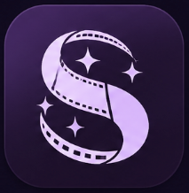
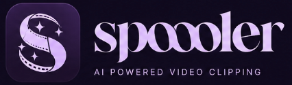

<div align="center">
  

  <h1>
    
  </h1>

  <p><strong>Local-first Instagram reel production, driven entirely over MCP.</strong></p>

  <p>
    
    
    
    
  </p>
</div>

---

> **MCP is the sole entry point.** All invocations go through the MCP server
> (`node mcp/server.mjs`, or `node mcp/client.mjs <tool> '<json>'` from a
> shell). There is no web UI or HTTP API — the `instagram-reel-generator.mjs`
> engine refuses to run unless the MCP server spawns it (`REEL_VIA_MCP`).
> Start with [VIDEO-DIRECTOR-SKILL.md](VIDEO-DIRECTOR-SKILL.md) (how to direct
> a reel) and [FOOTAGE-MCP-SKILL.md](FOOTAGE-MCP-SKILL.md) / [mcp/README.md](mcp/README.md)
> (the tool catalog).

Spoooler turns raw footage, an Instagram URL, or a one-line topic into a finished, post-ready 1080×1920 reel — orchestrated tool-by-tool by whatever AI coding assistant you drive it with over MCP.

It can:

- expose that workflow over MCP so Codex and other MCP hosts can drive it tool-by-tool
- scrape real product media
- collect stock backgrounds
- generate voiceover with Kokoro or your own cloned `pocket-tts`/TADA voices
- align captions with `whisper.cpp`
- render the final MP4 with Remotion

## What works out of the box vs. what's bring-your-own

| Capability | Requires |
|---|---|
| Topic/transcript → scripted reel, stock media, captions, render | API keys only (see below) |
| Instagram URL / uploaded video → transcript | your own MCP-compatible transcriber (`IG_TRANSCRIBER_ROOT`) — **not included** |
| Cloned-voice narration (Pocket-TTS / TADA) | your own voice embeddings — **not included** |
| Product/brand media scraping | Scrapling + Playwright installed locally |

None of these are required to try the tool — `--skip-transcribe --transcript "..."` gets you a full render with zero external transcriber or voice setup.

## System requirements

- Node.js 20 or 22
- npm 10+
- Python 3.11+
- `ffmpeg` and `ffprobe`
- Git

Optional, only if you use these features:

- a Scrapling-capable Python venv (product/brand media scraping)
- `pocket-tts` on `PATH` (cloned-voice narration)
- an MLX-TADA setup on Apple Silicon (alternate cloned-voice engine)
- an MCP-compatible transcriber (Instagram URL / video upload input)

You'll also need API keys for whichever of these you want to use: Google Gemini, NVIDIA NIM, Groq, Pexels, Unsplash, logo.dev.

## Quick start

```bash
git clone <this-repo-url>
cd instagram-reel-tool
npm install
cp .env.example .env
```

Fill in `.env` with the keys you want (see "Environment variables" below — most are optional and the tool degrades gracefully without them).

Verify the main packages resolve:

```bash
node -e "require.resolve('@modelcontextprotocol/sdk')"
node -e "require.resolve('remotion')"
node -e "require.resolve('@remotion/install-whisper-cpp')"
node -e "require.resolve('zod')"
```

Run the offline smoke test (no Instagram download, no LLM calls, no TTS):

```bash
node instagram-reel-generator.mjs \
  --skip-transcribe \
  --skip-tts \
  --offline \
  --transcript "Stop automating random tasks. The best AI systems start by finding the workflow bottleneck. Then they remove one handoff and measure the result." \
  --topic "AI workflow automation for founders"
```

This writes run artifacts under `runs/<slug>/`.

## Environment variables

Copy `.env.example` to `.env`. Key variables:

- `GOOGLE_API_KEY`, `GEMINI_MODEL` — script generation (primary)
- `NVIDIA_API_KEY`, `NVIDIA_MODEL` — script generation (tried before Gemini)
- `GROQ_API_KEY`, `GROQ_MODEL` — script generation (final fallback)
- `KOKORO_API_URL`, `KOKORO_API_KEY`, `KOKORO_MODEL`, `KOKORO_VOICE`, `KOKORO_SPEED` — Kokoro TTS
- `PEXELS_API_KEY`, `UNSPLASH_ACCESS_KEY` — stock media
- `LOGO_DEV_PUBLIC_KEY`, `LOGO_DEV_TOKEN` — brand logo fetching
- `IG_TRANSCRIBER_ROOT` — **optional**, absolute path to your own MCP-compatible transcriber (see below)
- `SCRAPLING_PYTHON` — path to a Python interpreter with Scrapling installed
- `FFMPEG_PATH`, `WHISPER_MODEL` — rendering/captions
- `POCKET_TTS_VOICE`, `POCKET_TTS_TONE`, `POCKET_TTS_QUALITY` — cloned-voice narration
- `TADA_*` — alternate cloned-voice engine (see below)

None of these are required just to install and run the offline smoke test above.

## Optional: Instagram URL / video transcription — pairs with ReelRecon

Transcribing an Instagram reel URL or an uploaded video file requires a separate MCP-compatible transcriber that this repo does not include. It must expose a `run_mcp_server.sh` script and a `transcribe_input` tool (input URL/path → transcript text).

**[ReelRecon](https://github.com/4nw3rprod/ReelRecon)** — a companion tool, also by this author — is a drop-in fit: it transcribes Instagram profiles, direct video URLs, or uploaded audio/video with Whisper, and ships its own `run_mcp_server.sh` + `transcribe_input` MCP tool with exactly this interface. Typical pairing:

```bash
git clone https://github.com/4nw3rprod/ReelRecon.git
```

```dotenv
IG_TRANSCRIBER_ROOT=/absolute/path/to/ReelRecon
```

Feed a raw Instagram reel into ReelRecon for a clean transcript, then hand that transcript to Spoooler (via `transcribe_source` / `--transcript`) to script, voice, caption, and render the derivative reel — two focused tools instead of one that tries to do both.

Without it, Spoooler still works fully via `--transcript` or a plain `--topic` — you just skip the "give me a URL" step and provide the script input directly.

## Optional: cloned-voice narration

The tool supports two cloned-voice backends. Neither ships with any voice data — bring your own.

### Pocket-TTS (Kyutai)

1. Install the `pocket-tts` CLI and verify `pocket-tts --help` works.
2. Create a voice embedding (`.safetensors`) with whatever tooling you use to produce Kyutai-compatible embeddings.
3. Place it under `audio/pocket-tts/voices/` (sibling to this repo, i.e. `../audio/pocket-tts/voices/`) along with a `voices.json` index:

```json
[
  {"id": "my-voice", "name": "My Voice", "embeddingFile": "my-voice.safetensors"}
]
```

4. Set `POCKET_TTS_VOICE=audio/pocket-tts/voices/my-voice.safetensors` in `.env`, or pass `--voice-file` per run.

If `voices.json` is missing or malformed, the MCP `list_voices` tool simply returns no cloned voices — Kokoro presets still work.

### TADA (Hume MLX, Apple Silicon)

Optional alternate voice-cloning engine, clones from a short reference audio clip + its transcript instead of a pre-trained embedding.

```bash
python3 -m venv .venv-tada
source .venv-tada/bin/activate
python -m pip install --upgrade pip setuptools wheel
pip install mlx-tada
```

```dotenv
TADA_PYTHON=/absolute/path/to/.venv-tada/bin/python3
TADA_MODEL=HumeAI/mlx-tada-1b
TADA_PROMPT_AUDIO=/absolute/path/to/your/reference.wav
TADA_PROMPT_TEXT=
TADA_REFERENCE_CACHE=/absolute/path/to/instagram-reel-tool/.cache/tada/default-reference.npz
```

Notes:

- Apple Silicon only; follows Hume's `apple/` implementation.
- Depends on the gated Meta Llama 3.2 base models on Hugging Face for the tokenizer.
- `TADA_PROMPT_AUDIO` (your own reference clip) is required; `TADA_PROMPT_TEXT` is optional.
- Use `TADA_MODEL=HumeAI/mlx-tada-1b` (English) or `HumeAI/mlx-tada-3b` (multilingual).
- Set `TADA_WEIGHTS`/`TADA_TOKENIZER` to force local weights/tokenizer instead of Hub downloads.
- Trigger via `voiceEngine=tada` in the MCP `synthesize_voice` tool, or `--voice-engine tada` on the CLI.
- Wrapper script: [scripts/tada-tts.py](scripts/tada-tts.py).

## Optional: product/brand media scraping (Scrapling)

The media-scraping pipeline uses Python and [Scrapling](https://github.com/D4Vinci/Scrapling).

```bash
python3 -m venv .venv-scrapling
source .venv-scrapling/bin/activate
python -m pip install --upgrade pip setuptools wheel
pip install "scrapling>=0.4,<0.5"
python -m playwright install
```

```dotenv
SCRAPLING_PYTHON=/absolute/path/to/instagram-reel-tool/.venv-scrapling/bin/python3
```

Verify:

```bash
source .venv-scrapling/bin/activate
python - <<'PY'
from scrapling.fetchers import Fetcher, DynamicFetcher, StealthyFetcher
print("scrapling fetchers ok")
PY
```

If Scrapling isn't set up, product scraping degrades to stock-media-only rather than failing the run.

## MCP server

This repository includes an MCP server at [mcp/server.mjs](mcp/server.mjs).

### Local smoke tests

```bash
node mcp/test-client.mjs
node mcp/test-strategy.mjs
```

These confirm the server starts, tools register, and the strategy fast path works without an LLM script-generation step.

### MCP host configuration

Most MCP hosts use a JSON `mcpServers` config, e.g. for a generic host settings file:

```json
{
  "mcpServers": {
    "instagram-reel-tool": {
      "command": "node",
      "args": ["/ABSOLUTE/PATH/TO/instagram-reel-tool/mcp/server.mjs"]
    }
  }
}
```

### Codex configuration

Add to `~/.codex/config.toml`:

```toml
[mcp.instagram-reel-tool]
command = "node"
args = ["/ABSOLUTE/PATH/TO/instagram-reel-tool/mcp/server.mjs"]
```

See [mcp/README.md](mcp/README.md) for the full tool catalog and more host examples.

## Full render check

Once keys and (optionally) voices are configured:

```bash
node instagram-reel-generator.mjs \
  --skip-transcribe \
  --transcript "This is a short test reel about AI workflow automation." \
  --topic "AI workflow automation" \
  --render
```

Notes:

- the first `whisper.cpp` alignment run can take a while because the model installs into `.cache/whisper-align`
- the first cloned-voice run can take longer while `pocket-tts` loads
- if no media APIs are configured, renders complete but with empty or degraded media layers

## Troubleshooting

### `list_voices` returns no cloned voices

Check `../audio/pocket-tts/voices/voices.json` and the referenced `.safetensors` files exist.

### Scraping returns nothing

Check `SCRAPLING_PYTHON` points to a working venv, Scrapling imports successfully, Playwright's browsers are installed, and you have network access.

### Video upload fails to transcribe

Check `IG_TRANSCRIBER_ROOT` points to a working transcriber exposing `run_mcp_server.sh` + `transcribe_input`, `ffmpeg` works, and the uploaded file is under 200 MB.

### Cloned voice generation fails

Check `pocket-tts` is on `PATH`, the selected `.safetensors` file exists, and `voices.json` references the correct embedding filename.

### Captions do not align

Check `ffmpeg` is installed, `npm install` completed successfully, `@remotion/install-whisper-cpp` resolves, and the first whisper model install was allowed to complete.

### Render succeeds but visuals are empty

Check `PEXELS_API_KEY`/`UNSPLASH_ACCESS_KEY` are set and stock/scraped media actually downloaded into the run folder.

## Files worth reading

- [README-instagram-reel-generator.md](README-instagram-reel-generator.md)
- [mcp/README.md](mcp/README.md)
- [SKILL.md](SKILL.md)
- [instagram-reel-generator.mjs](instagram-reel-generator.mjs)

## Related project

- **[ReelRecon](https://github.com/4nw3rprod/ReelRecon)** — Instagram/video transcription over MCP or web UI. See [Optional: Instagram URL / video transcription](#optional-instagram-url--video-transcription--pairs-with-reelrecon) above for how the two fit together.

## Built with

Spoooler is a thin orchestration layer over a handful of open-source projects doing the real work:

| Project | Role |
|---|---|
| [Remotion](https://www.remotion.dev/) | React-based video composition and MP4 rendering |
| [Model Context Protocol SDK](https://github.com/modelcontextprotocol/typescript-sdk) | the MCP server/client this tool is entirely driven through |
| [whisper.cpp](https://github.com/ggml-org/whisper.cpp) (via `@remotion/install-whisper-cpp`) | word-level caption alignment |
| [Scrapling](https://github.com/D4Vinci/Scrapling) + [Playwright](https://playwright.dev/) | product/brand media discovery and scraping |
| [Kokoro](https://github.com/hexgrad/kokoro) | default text-to-speech voices |
| [Kyutai's Pocket-TTS](https://github.com/kyutai-labs) | optional bring-your-own cloned-voice narration |
| [Hume's TADA (MLX)](https://github.com/HumeAI) | optional alternate bring-your-own voice-cloning engine, Apple Silicon |
| [Next.js](https://nextjs.org/) | the landing page / marketing surface |
| [Zod](https://zod.dev/) | MCP tool input schema validation |

Full dependency list in [package.json](package.json).

## License

MIT — see [LICENSE](LICENSE).

<div align="center">
  <sub>Built locally, rendered with Remotion.</sub>
</div>
